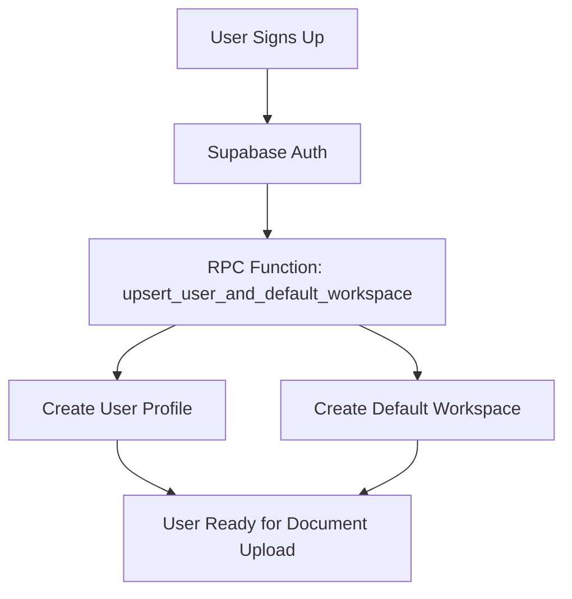
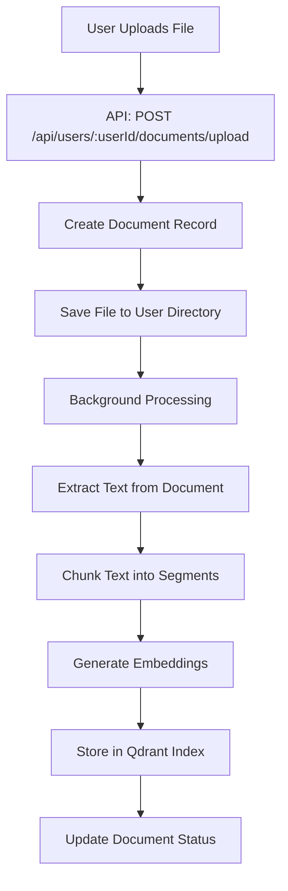
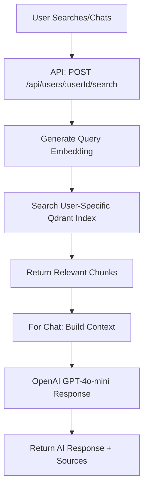

# PersonaVault Complete Flow Analysis

## 🎯 **System Overview**

PersonaVault is a multi-user document management and AI-powered search system that provides:

1. **Multi-User Document Storage** with isolated data spaces
2. **Semantic Search** using Qdrant vector database
3. **AI-Powered Chat** with document context
4. **Workspace Organization** for document categorization
5. **Real-time Processing** with background ingestion

## 🏗️ **Architecture Components**

### **1. Database Layer (Supabase)**
- **Users Table**: User profiles and authentication
- **User Workspaces**: Multi-workspace support per user
- **Documents**: Document metadata and status tracking
- **Document Chunks**: Vector metadata and relationships

### **2. Vector Database (Qdrant Cloud)**
- **User-Specific Indexes**: `personavault-documents-{userId}`
- **Vector Storage**: 1536-dimensional embeddings
- **Semantic Search**: OpenAI text-embedding-3-small

### **3. API Layer (Express.js)**
- **RESTful Endpoints**: Multi-user API with user isolation
- **File Upload**: Multer middleware for document processing
- **Validation**: Zod schemas for request validation
- **Error Handling**: Consistent error responses

### **4. Processing Pipeline**
- **Document Extraction**: PDF, DOC, DOCX, TXT, MD support
- **Text Chunking**: 750 tokens with 100 token overlap
- **Embedding Generation**: OpenAI embeddings
- **Vector Storage**: Qdrant with metadata

## 🔄 **Complete User Flow**

### **Phase 1: User Onboarding**


### **Phase 2: Document Upload & Processing**


### **Phase 3: Search & Chat**


## 📊 **API Endpoints Analysis**

### **User Management Endpoints**
| Endpoint | Method | Purpose | Auth Required |
|----------|--------|---------|---------------|
| `/api/users/:userId/profile` | GET | Get user profile | ✅ User ID |
| `/api/users/:userId/workspaces` | GET | List user workspaces | ✅ User ID |
| `/api/users/:userId/workspaces` | POST | Create workspace | ✅ User ID |

### **Document Management Endpoints**
| Endpoint | Method | Purpose | Auth Required |
|----------|--------|---------|---------------|
| `/api/users/:userId/documents` | GET | List user documents | ✅ User ID |
| `/api/users/:userId/documents/upload` | POST | Upload document | ✅ User ID |
| `/api/users/:userId/documents/:documentId` | DELETE | Delete document | ✅ User ID |

### **Search & AI Endpoints**
| Endpoint | Method | Purpose | Auth Required |
|----------|--------|---------|---------------|
| `/api/users/:userId/search` | POST | Semantic search | ✅ User ID |
| `/api/users/:userId/chat` | POST | AI chat with docs | ✅ User ID |

### **Analytics Endpoints**
| Endpoint | Method | Purpose | Auth Required |
|----------|--------|---------|---------------|
| `/api/users/:userId/stats` | GET | User statistics | ✅ User ID |

## 🔐 **Multi-User Security Model**

### **1. User Isolation**
```typescript
// Each user gets their own Qdrant index
const indexName = `personavault-documents-${userId}`;

// All database queries filter by user_id
const { data } = await supabase
  .from('documents')
  .select('*')
  .eq('user_id', userId);
```

### **2. Row-Level Security (RLS)**
```sql
-- Users can only access their own data
CREATE POLICY "Users can only access their own data" ON documents
FOR ALL USING (auth.uid() = user_id);
```

### **3. Workspace Isolation**
```typescript
// Documents are tied to specific workspaces
const document = {
  user_id: userId,
  workspace_id: workspaceId,
  title: fileName,
  // ... other fields
};
```

## 📈 **Data Flow Analysis**

### **Document Ingestion Flow**
```typescript
// 1. File Upload
const formData = new FormData();
formData.append('file', file);
formData.append('workspaceId', workspaceId);

// 2. API Processing
const result = await personavaultApi.uploadDocument(
  userId,
  workspaceId,
  fileBuffer,
  fileName,
  fileType
);

// 3. Background Processing
const pipeline = new MultiUserDocumentIngestionPipeline({
  userId,
  workspaceId,
  dataDir: path.dirname(filePath),
  chunkSize: 750,
  chunkOverlap: 100,
  batchSize: 3,
});

// 4. Vector Storage
await qdrantStore.upsertVector({
  indexName: `personavault-documents-${userId}`,
  vector: embedding,
  metadata: {
    text: chunk,
    userId,
    workspaceId,
    documentId,
    chunkIndex,
    totalChunks,
  },
});
```

### **Search Flow**
```typescript
// 1. Query Processing
const { embedding } = await embed({
  model: openai.embedding('text-embedding-3-small'),
  value: query,
});

// 2. Vector Search
const searchResults = await qdrantStore.query({
  indexName: `personavault-documents-${userId}`,
  queryVector: embedding,
  topK: 10,
  filter: workspaceId ? { workspaceId: { $eq: workspaceId } } : undefined,
});

// 3. Result Transformation
const results = searchResults.map(result => ({
  id: result.id,
  score: result.score,
  text: result.metadata?.text || '',
  metadata: result.metadata,
}));
```

### **Chat Flow**
```typescript
// 1. Search for Relevant Documents
const searchResponse = await this.searchDocuments(
  userId,
  message,
  workspaceId,
  undefined,
  5
);

// 2. Build Context
const context = searchResponse.data
  .map(result => `Document: ${result.metadata.title}\nContent: ${result.text}`)
  .join('\n\n');

// 3. Generate AI Response
const response = await openai.chat.completions.create({
  model: 'gpt-4o-mini',
  messages: [
    {
      role: 'system',
      content: 'You are PersonaVault, a helpful AI assistant...'
    },
    {
      role: 'user',
      content: `Context from user's documents:\n${context}\n\nUser question: ${message}`
    }
  ],
  max_tokens: 1000,
  temperature: 0.7,
});
```

## 🎨 **Frontend Integration Points**

### **React Hook Example**
```typescript
export function usePersonaVault({ userId, workspaceId }: UsePersonaVaultProps) {
  const [documents, setDocuments] = useState([]);
  const [loading, setLoading] = useState(false);
  const [error, setError] = useState<string | null>(null);

  const uploadDocument = async (file: File) => {
    const formData = new FormData();
    formData.append('file', file);
    formData.append('workspaceId', workspaceId!);

    const response = await fetch(`/api/users/${userId}/documents/upload`, {
      method: 'POST',
      body: formData,
    });

    return response.json();
  };

  const searchDocuments = async (query: string) => {
    const response = await fetch(`/api/users/${userId}/search`, {
      method: 'POST',
      headers: { 'Content-Type': 'application/json' },
      body: JSON.stringify({ query, workspaceId }),
    });

    return response.json();
  };

  const chatWithDocuments = async (message: string) => {
    const response = await fetch(`/api/users/${userId}/chat`, {
      method: 'POST',
      headers: { 'Content-Type': 'application/json' },
      body: JSON.stringify({ message, workspaceId }),
    });

    return response.json();
  };

  return {
    documents,
    loading,
    error,
    uploadDocument,
    searchDocuments,
    chatWithDocuments,
  };
}
```

## 🚀 **Performance Optimizations**

### **1. Batch Processing**
```typescript
// Process documents in batches to avoid memory issues
const batchSize = 3;
const limit = pLimit(5); // Limit concurrent API calls
```

### **2. Async Processing**
```typescript
// Document processing happens in background
this.processDocumentAsync(document.id, userId, workspaceId, filePath, fileName);
```

### **3. Caching Strategy**
```typescript
// User-specific indexes for fast retrieval
const indexName = `personavault-documents-${userId}`;
```

### **4. Error Handling**
```typescript
// Graceful error handling with user feedback
try {
  const result = await personavaultApi.uploadDocument(...);
  if (result.success) {
    // Show success message
  } else {
    // Show error message
  }
} catch (error) {
  // Handle network errors
}
```

## 📋 **Environment Configuration**

### **Required Environment Variables**
```env
# API Configuration
API_PORT=4111
FRONTEND_URL=http://localhost:3000

# Qdrant Cloud Configuration
QDRANT_URL=https://your-cluster-url.cloud.qdrant.io:6333
QDRANT_API_KEY=your_api_key_here

# OpenAI Configuration
OPENAI_API_KEY=your_openai_api_key_here

# Supabase Configuration
SUPABASE_URL=your_supabase_project_url
SUPABASE_ANON_KEY=your_supabase_anon_key
```

## 🧪 **Testing Strategy**

### **API Testing**
```bash
# Test all endpoints
npm run test-api

# Test specific functionality
npm run test-upload
npm run test-search
npm run test-chat
```

### **Integration Testing**
```typescript
// Test complete user flow
1. Create user and workspace
2. Upload document
3. Wait for processing
4. Search documents
5. Chat with documents
6. Verify results
```

## 🔮 **Future Enhancements**

### **1. Real-time Updates**
- WebSocket connections for live document processing status
- Real-time chat with streaming responses

### **2. Advanced Search**
- Filter by document type, date range, tags
- Saved searches and search history

### **3. Collaboration Features**
- Shared workspaces between users
- Document commenting and annotations

### **4. Advanced AI Features**
- Document summarization
- Automatic tagging and categorization
- Question-answering from specific documents

## 📊 **Monitoring & Analytics**

### **Key Metrics**
- Document processing time
- Search response time
- Chat response quality
- User engagement metrics

### **Error Tracking**
- Failed document uploads
- Processing errors
- API response times
- User error patterns

This comprehensive analysis provides a complete understanding of the PersonaVault system architecture, data flow, and API design for multi-user document management and AI-powered search. 